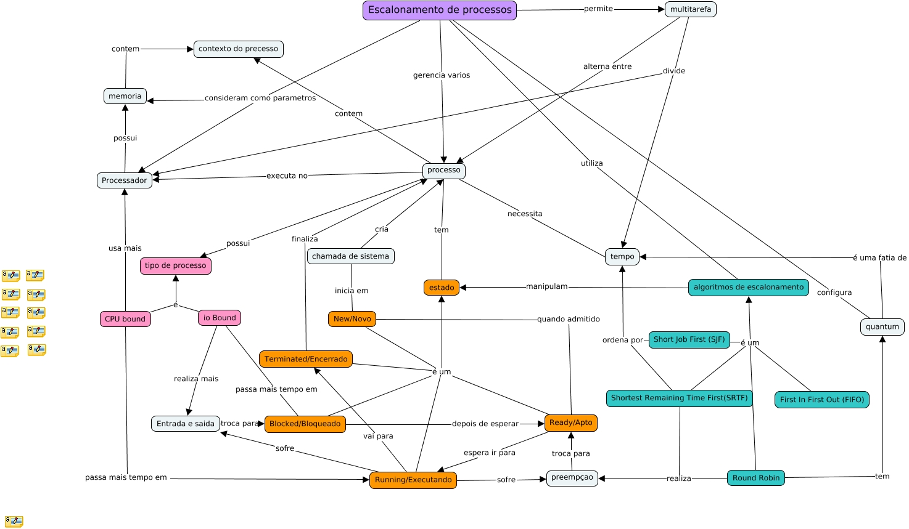
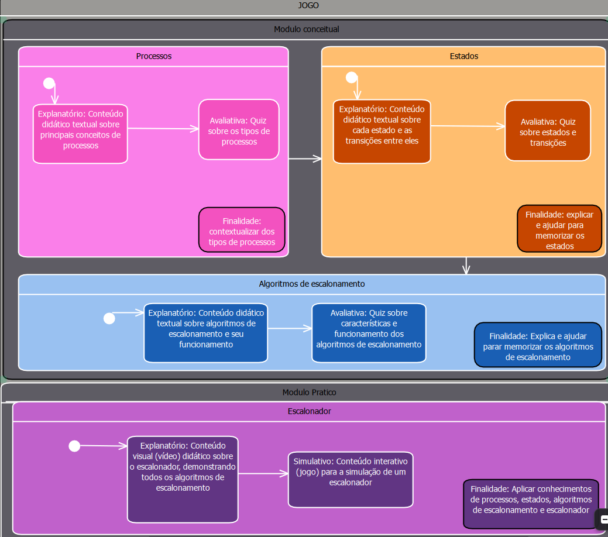

# Simulador de Escalonamento de Processos (Objeto de Aprendizagem)

---

## Sobre o Projeto
Este projeto é um Objeto de Aprendizagem web com conteúdo interativo e simulações, focado no ensino de Sistemas Operacionais, especificamente sobre **Escalonamento de Processos**. O objetivo é apoiar o aluno desde a teoria por trás dos estados de um processo e seu ciclo de vida até o entendimento prático das regras dos principais algoritmos de escalonamento.

O desenvolvimento e a estruturação pedagógica seguem a abordagem **IMA-CID** (Integrated Modeling Approach – Conceptual, Instructional, and Didactic), garantindo o alinhamento entre o domínio computacional, os objetivos de aprendizagem (baseados na Taxonomia de Bloom) e as estratégias de interface e avaliação.

---
 
## Público-Alvo
 
Estudantes de graduação em cursos da área de Computação, cursando a disciplina de **Sistemas Operacionais**.Também pode ser utilizado por **professores** como ferramenta de apoio em aula,para demonstrar visualmente o comportamento dos algoritmos de escalonamento.

---

## Requisitos de Aprendizagem

### Requisito 01 — Memorizar
 
**Objetivo:** O aluno deve ser capaz de listar e definir os estados de um processo: *New*, *Ready*, *Running*, *Blocked* e *Terminated*.
 
### Requisito 02 — Memorizar
 
**Objetivo:** O aluno deve ser capaz de listar e definir os principais algoritmos de escalonamento: *FCFS (First Come, First Served)*, *Round Robin* e *Prioridade*.
 
### Requisito 03 — Compreender
 
**Objetivo:** O aluno deve ser capaz de compreender o ciclo de vida de um processo e as transições possíveis entre seus estados.
 
### Requisito 04 — Aplicar
 
**Objetivo:** O aluno deve ser capaz de aplicar as regras dos algoritmos de escalonamento ao receber uma fila de processos, lidando com diferentes situações.

---

## Mapa Conceitual


[Visualizar no CmapCloud](https://cmapscloud.ihmc.us:443/rid=22KBZDTGF-2488CDD-DX0HMF)

O conteúdo do sistema gira em torno de três eixos principais:

- **Processos:** diferença entre processos *CPU Bound* e *I/O Bound*
- **Estados e Ciclo de Vida:** transições entre *New*, *Ready*, *Running*, *Blocked* e *Terminated*, desencadeadas por chamadas de sistema, preempção ou operações de I/O
- **Algoritmos de Escalonamento:** funcionamento do *FCFS*, *Round Robin* (com quantum) e *Prioridade*

---

## Mapa Instrucional


[modeloInstrucional.png](modeloInstrucional.png)

A navegação é dividida em dois módulos. Cada tópico do módulo conceitual segue o ciclo **explicação → avaliação**, preparando o aluno para o módulo prático.

**Módulo Conceitual** — fundamentação teórica

- **Processos:** conteúdo sobre tipos de processo + quiz de contextualização
- **Estados:** explicação de cada estado e suas transições + quiz de fixação
- **Algoritmos:** funcionamento de cada algoritmo + avaliação de memorização

**Módulo Prático** — aplicação em simulação

- **O Escalonador:** vídeo demonstrativo dos algoritmos em ação, seguido do simulador interativo (O Jogo), onde o aluno aplica tudo que aprendeu no módulo anterior

---

## Tecnologias 
* **Frontend:** React (Plataforma Web)
* **Telemetria Pedagógica:** Rastreamento interno de métricas (erros e acertos) para validação do aprendizado do aluno.

---

## Como Executar o Projeto

1. Clone o repositório:
```bash
   git clone https://github.com/cDanx/escalonamento_simulador
